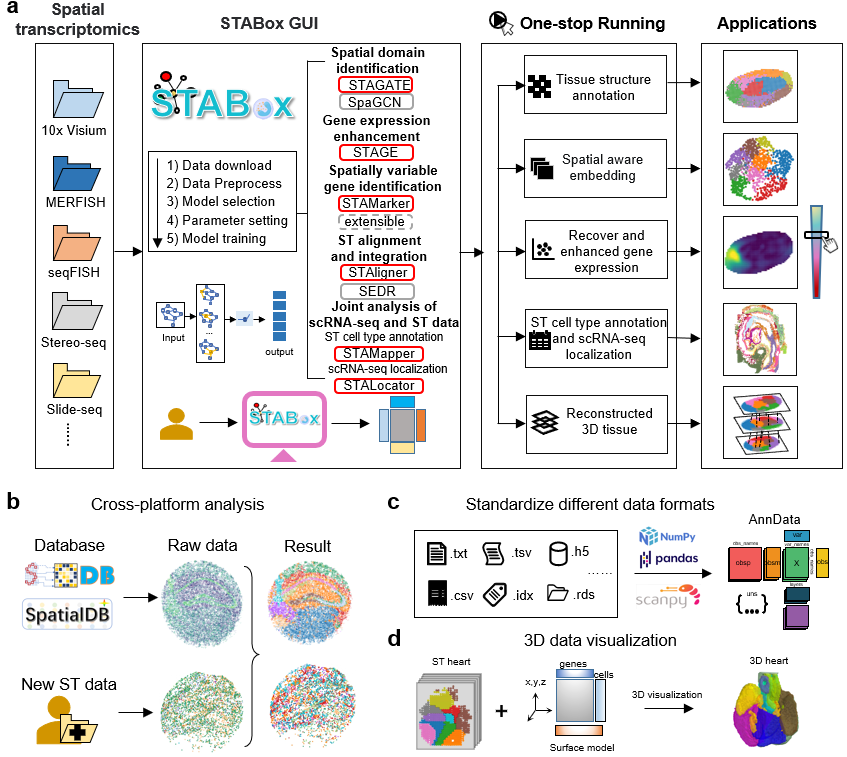

.. STABox documentation master file, created by
   sphinx-quickstart on Tue May 28 23:22:23 2024.
   You can adapt this file completely to your liking, but it should at least
   contain the root `toctree` directive.

STABox: a one-stop platform for versatile spatial transcriptomics data analysis and three-dimensional visualization
==================================

.. toctree::
   :maxdepth: 1
   
   Installation
   Tutorial_STABox_STAGATE
   Tutorial_STABox_STAligner
   Tutorial_STABox_STAMarker
   Tutorial_STABox_STAGE
   Tutorial_STABox_STAMapper
   Tutorial_STABox_STALocator
   Tutorial_STABox_STData_Download

Introduction
==================
STABox is a one-stop platform for spatial transcriptomics data that provide a unified data processing pipeline, versatile data analysis modules, and interactive visualization. It integrates a suite of advanced analysis tools based on graph neural networks. STABox supports interactive 2D/3D visualization of spatial transcriptomics data, simplifying the generation and refinement of publication-ready high-quality images. STABox is extensible, allowing for seamless integration with various analysis methods to facilitate comprehensive downstream analysis of spatial transcriptomics data.

Manuscript
==================
Please see our manuscript ...

